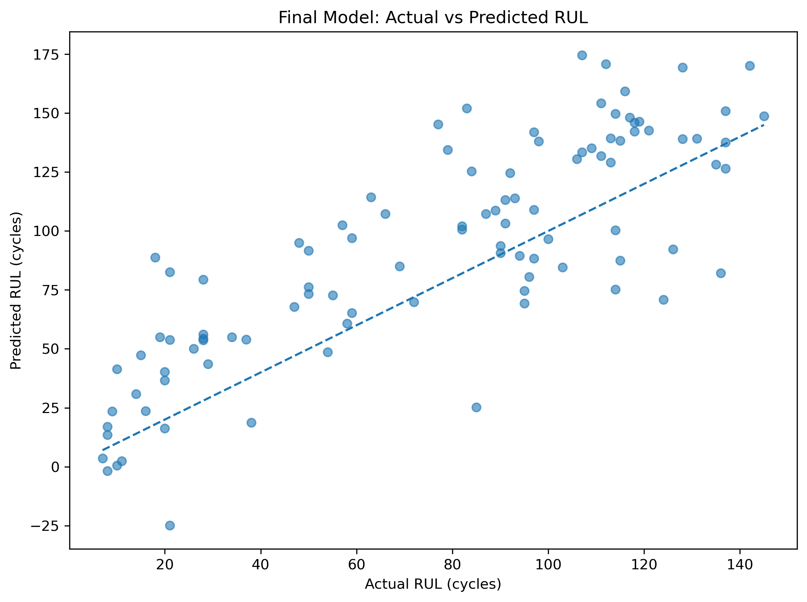
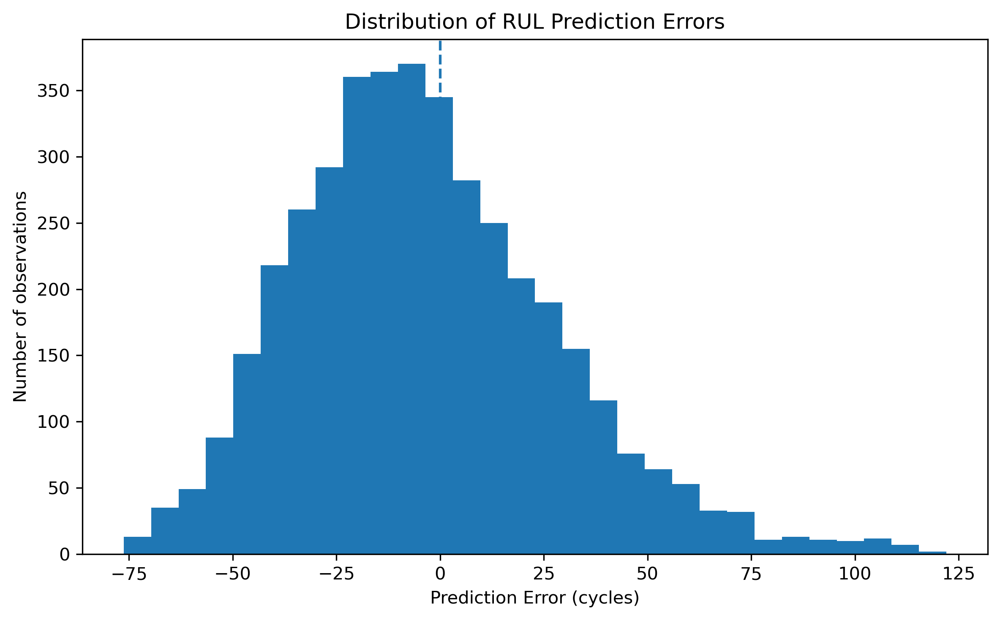

# NASA C-MAPSS FD001 — Remaining Useful Life Prediction

**Author:** Pallavi Dahiya

<p align="center">
  
</p>

## Overview

This project focuses on predicting the **Remaining Useful Life (RUL)** of turbofan engines using the **NASA C-MAPSS FD001** dataset.

The goal is to estimate how many operating cycles an engine has remaining before failure using its operating history and sensor measurements.

I developed this project as a complete machine learning workflow rather than jumping directly into model training. I first studied the data and degradation behavior, prepared the RUL target, removed uninformative features, built a baseline model, tested alternative approaches, compared them using the same validation setup, and finally evaluated the selected model on completely unseen test engines.

---

## Problem Statement

RUL prediction is a **regression problem**.

The model learns the relationship between the current operating condition of an engine and the number of cycles remaining before failure.

```text
Operating history + Sensor measurements
                    ↓
              RUL prediction
                    ↓
       Remaining cycles before failure
```

For the training data:

```text
RUL = Maximum cycle of the engine - Current cycle
```

For example:

```text
Maximum cycle = 200
Current cycle = 50

RUL = 200 - 50
    = 150 cycles
```

---

## Dataset

The project uses the **NASA C-MAPSS FD001** dataset.

The data contains:

- Engine/unit ID
- Operating cycle
- 3 operational settings
- 21 sensor measurements
- Training RUL target
- Separate test engines
- Actual RUL values for the test engines

Each engine contains multiple observations across its operating life.

The final test set contains **100 test engines**, with one actual RUL value available for each test engine.

---

# Project Workflow

```text
Problem Understanding
        ↓
Data Understanding
        ↓
Exploratory Data Analysis
        ↓
RUL Target Creation
        ↓
Data Preprocessing
        ↓
Feature Analysis
        ↓
Linear Regression Baseline
        ↓
Feature Selection
        ↓
Ridge / Lasso
        ↓
RUL Capping Experiment
        ↓
Random Forest
        ↓
Random Forest Tuning
        ↓
Gradient Boosting
        ↓
Model Comparison
        ↓
Select Final Model
        ↓
Retrain on All Training Engines
        ↓
Evaluate on Unseen Test Engines
```

---

# Repository Structure

```text
Machine RUL Prediction - NASA C-MAPSS FD001/
│
├── data/
│   └── raw/
│       ├── train_FD001.txt
│       ├── test_FD001.txt
│       └── RUL_FD001.txt
│
├── notebooks/
│   ├── 01_problem_and_data_understanding.ipynb
│   ├── 02_exploratory_data_analysis.ipynb
│   ├── 03_data_preprocessing.ipynb
│   ├── 04_baseline_linear_regression.ipynb
│   ├── 05_tree_based_models.ipynb
│   ├── 06_gradient_boosting.ipynb
│   └── 07_final_model_evaluation.ipynb
│
├── reports/
│   └── figures/
│
├── src/
│   ├── __init__.py
│   └── preprocessing.py
│
├── project_findings.md
└── README.md
```

---

# Data Understanding and EDA

Before modeling, I focused on understanding how engine operating cycles and sensor measurements relate to RUL.

One of the clearest patterns was the relationship between **operating cycle and remaining useful life**.

```text
More operating cycles
        ↓
More engine degradation
        ↓
Lower remaining useful life
```

The coefficient analysis also showed that `cycle` had the strongest contribution among the features tested in the linear model.

| Feature | Coefficient |
|---|---:|
| cycle | -26.73 |
| sensor_11 | 6.56 |
| sensor_4 | 3.88 |
| sensor_7 | 3.84 |
| ... | ... |

The negative coefficient of `cycle` is consistent with the expected physical behavior of an aging engine.

Several sensor measurements also provided useful information about the degradation state.

---

# Prediction Error Analysis

The prediction error was calculated as:

```text
Prediction Error = Actual RUL - Predicted RUL
```

The distribution of errors helped me understand how the model behaves beyond a single metric.

<p align="center">
  
</p>

The error distribution is centered reasonably close to zero, although there are both positive and negative errors and some larger deviations.

This is important because a model can have a reasonable average error while still making some large individual predictions.

---

# Validation Strategy

A major consideration in this project was avoiding information leakage between engines.

Each engine contains multiple observations. Randomly splitting individual rows could place observations from the same engine in both training and validation data.

Instead, I used an **engine-level split**.

```text
Training Engines
       ↓
Model Training

Validation Engines
       ↓
Model Evaluation
```

This gives a more realistic estimate of how the model behaves when it encounters engines that were not used during training.

---

# Why I Started With Linear Regression

I intentionally started with Linear Regression.

I did not choose it simply because it is easy, and I did not assume that it would automatically be the best model.

The data itself gave several reasons to start with a linear approach:

- RUL decreases as operating cycle increases.
- `cycle` showed a strong relationship with RUL.
- Several sensors contained useful information about degradation.
- The overall degradation pattern was relatively smooth.
- RUL is a continuous target, making regression appropriate.

So the reasoning was:

```text
Data shows a strong overall degradation trend
                    ↓
Linear Regression is a reasonable starting point
                    ↓
Build a baseline
                    ↓
Test whether more complex models improve it
```

This was a **data-driven starting point**, not a final assumption.

---

# Model Experiments

## 1. Linear Regression — Baseline

Linear Regression was used as the first benchmark because it is interpretable and can capture an overall continuous relationship between the features and RUL.

### Validation Performance

| Metric | Result |
|---|---:|
| MAE | **25.16 cycles** |
| RMSE | **31.66 cycles** |
| R² | **0.768** |

This became the benchmark for the remaining experiments.

---

## 2. Feature Selection

I tested whether keeping only the strongest features would improve the model.

The reduced feature set performed slightly worse than the baseline.

### Decision

I kept the broader useful feature set.

### Lesson

A feature does not have to be individually dominant to provide useful information when combined with other features.

---

## 3. Ridge Regression

I tested Ridge Regression to determine whether regularization could improve the linear model.

The performance was essentially the same as the baseline.

### Decision

Ridge did not provide a meaningful improvement, so standard Linear Regression remained the stronger choice.

---

## 4. Lasso Regression

Lasso Regression was also tested.

### Validation Performance

| Metric | Result |
|---|---:|
| MAE | 25.15 cycles |
| RMSE | 31.66 cycles |
| R² | 0.767 |

The small change in MAE was not a meaningful overall improvement because R² was slightly lower.

### Decision

Linear Regression remained the preferred linear model.

---

## 5. RUL Capping

I tested whether limiting the maximum RUL to 125 cycles would make the prediction problem easier.

The original maximum RUL in the training data was **361 cycles**.

### Result

| Metric | Result |
|---|---:|
| MAE | 31.39 cycles |
| RMSE | 43.43 cycles |
| R² | 0.562 |

The performance dropped significantly.

### Decision

I rejected RUL capping.

The higher RUL values contained useful information, and removing that information damaged the prediction performance.

---

# Tree-Based Models

## 6. Random Forest

After testing linear approaches, I wanted to determine whether nonlinear tree-based models could capture relationships that Linear Regression might miss.

Random Forest was tested because it can learn nonlinear relationships without requiring a linear relationship between each feature and the target.

### Initial Result

| Metric | Result |
|---|---:|
| MAE | 28.00 cycles |
| RMSE | 39.46 cycles |
| R² | 0.698 |

Random Forest performed worse than Linear Regression.

---

## 7. Random Forest Tuning

I tested a small number of reasonable configurations instead of performing unnecessary large-scale tuning.

The best tested configuration was:

```text
n_estimators = 300
min_samples_leaf = 2
```

### Best Result

| Metric | Result |
|---|---:|
| MAE | 27.87 cycles |
| RMSE | 39.34 cycles |
| R² | 0.700 |

The tuning produced a small improvement, but the model remained behind Linear Regression.

### Decision

I stopped further Random Forest tuning because the improvement was too small to justify continuing.

---

## 8. Gradient Boosting

Gradient Boosting was tested as another nonlinear tree-based approach.

It builds trees sequentially, where later trees focus on correcting errors made by earlier trees.

### Result

| Metric | Result |
|---|---:|
| MAE | 27.76 cycles |
| RMSE | 38.91 cycles |
| R² | 0.707 |

Gradient Boosting performed slightly better than Random Forest, but it still did not outperform Linear Regression.

---

# Model Comparison

| Model | MAE ↓ | RMSE ↓ | R² ↑ |
|---|---:|---:|---:|
| **Linear Regression** | **25.16** | **31.66** | **0.768** |
| Random Forest | 27.87 | 39.34 | 0.700 |
| Gradient Boosting | 27.76 | 38.91 | 0.707 |

### Selected Model

**Linear Regression**

The selection was based on both:

1. The structure and behavior observed in the data.
2. The validation performance from controlled experiments.

I did not choose the most complex algorithm. I chose the model that was best supported by the data and the validation results.

---

# Why Linear Regression Won

The FD001 data showed a strong and relatively smooth degradation pattern.

The operating cycle had a strong relationship with RUL, while several sensor measurements also provided useful information about the degradation state.

This made a linear model a reasonable representation of the main relationship.

The validation experiments then supported that assumption.

The tree-based models were more complex, but they did not generalize as well on the validation engines.

```text
Data structure
      ↓
Linear model is reasonable
      ↓
Build baseline
      ↓
Test more complex models
      ↓
Complex models do not improve validation
      ↓
Linear Regression remains the best choice
```

The important conclusion is not that Linear Regression is always better than tree-based models.

The conclusion is that **for this FD001 setup and the feature representation used in this project, the simpler model matched the data better.**

---

# Main Modeling Insight

> **More complex models do not automatically produce better predictions.**

Random Forest and Gradient Boosting are more complex than Linear Regression, but they performed worse on our validation data.

This suggests that the main degradation relationship in this FD001 setup can be captured effectively by a simpler model.

Model selection should therefore be based on both:

- Understanding the data
- Evaluating the model objectively

---

# Final Model Evaluation

After completing model selection, I retrained Linear Regression using **all available training engines**.

The validation set was no longer required because the model had already been selected.

The final workflow became:

```text
All training engines
        ↓
Train selected Linear Regression
        ↓
Completely unseen test engines
        ↓
Final evaluation
```

The final evaluation used:

- `test_FD001.txt`
- `RUL_FD001.txt`

The test data was kept separate from model selection to avoid test-data leakage.

The final test metrics are recorded in:

`notebooks/07_final_model_evaluation.ipynb`

<p align="center">
  
</p>

The diagonal line represents perfect prediction. Points closer to the line indicate predictions closer to the actual RUL.

---

# Evaluation Metrics

## MAE — Mean Absolute Error

MAE measures the average absolute difference between predicted and actual RUL.

**Lower MAE = Better**

For example, an MAE of 25 cycles means that the model's predictions are off by about 25 cycles on average in absolute terms.

---

## RMSE — Root Mean Squared Error

RMSE also measures prediction error, but it gives more importance to larger errors.

**Lower RMSE = Better**

This is useful in RUL prediction because a few large prediction errors can be important.

---

## R² — Coefficient of Determination

R² indicates how much of the variation in RUL is explained by the model.

**Higher R² = Better**

---

# Key Findings

- Operating cycle has a strong relationship with RUL.
- Several sensor measurements provide useful information about engine degradation.
- Constant features do not provide useful predictive information and were removed.
- Engine-level validation was important because multiple observations belong to the same engine.
- The data showed a relatively smooth degradation pattern, making Linear Regression a reasonable starting approach.
- Linear Regression provided a strong and interpretable baseline.
- Feature selection did not improve the baseline.
- Ridge and Lasso did not provide meaningful improvements.
- RUL capping significantly reduced performance.
- Random Forest performed worse than Linear Regression.
- Random Forest tuning produced only a small improvement.
- Gradient Boosting performed slightly better than Random Forest but still worse than Linear Regression.
- The simpler model was more effective for this particular data representation and validation setup.
- The final model was evaluated separately on completely unseen test engines.

---

# Project Takeaway

The main learning from this project was not simply finding the model with the lowest validation error.

The bigger lesson was the importance of **understanding the data before increasing model complexity**.

I started by studying the relationship between engine cycles, sensor measurements, and RUL.

The data showed a strong and relatively smooth degradation pattern, so Linear Regression was a reasonable starting point.

I then tested whether more complex approaches could improve the baseline.

Feature selection, Ridge, Lasso, RUL capping, Random Forest, Random Forest tuning, and Gradient Boosting were evaluated using the same validation approach.

The experiments showed that the more complex models did not provide a meaningful improvement.

For this FD001 problem, the simpler Linear Regression model was able to capture the main degradation relationship effectively.

> **The best model is not necessarily the most complex model. It is the model that fits the structure of the data and performs reliably on unseen data.**

---

# Reproducibility

The notebooks are organized in the order in which the project was developed.

Run them in this order:

```text
01_problem_and_data_understanding.ipynb
02_exploratory_data_analysis.ipynb
03_data_preprocessing.ipynb
04_baseline_linear_regression.ipynb
05_tree_based_models.ipynb
06_gradient_boosting.ipynb
07_final_model_evaluation.ipynb
```

The shared preprocessing functionality is maintained in:

`src/preprocessing.py`

---

# Running the Project

## 1. Clone the repository

```bash
git clone <repository-url>
cd "Machine RUL Prediction - NASA C-MAPSS FD001"
```

## 2. Install dependencies

```bash
pip install pandas numpy scikit-learn matplotlib seaborn jupyter
```

## 3. Start Jupyter

```bash
jupyter lab
```

or:

```bash
jupyter notebook
```

## 4. Run the notebooks in order

Start with:

`notebooks/01_problem_and_data_understanding.ipynb`

and continue through:

`notebooks/07_final_model_evaluation.ipynb`

---

# Project Outputs

Generated visualizations are stored under:

`reports/figures/`

Important outputs include:

- Actual vs predicted RUL
- RUL prediction error distribution
- Final model prediction analysis

Detailed modeling decisions and findings are documented in:

`project_findings.md`

---

# Limitations

This project focuses on the NASA C-MAPSS FD001 dataset, so the results should be interpreted within that context.

Current limitations include:

- FD001 is a simulated turbofan engine dataset rather than live industrial sensor data.
- The project focuses on a single C-MAPSS subset.
- The final model is specific to the operating conditions and feature representation used in FD001.
- Linear Regression performed best in this project, but this does not mean it will outperform nonlinear models on other datasets.
- The current project does not include real-time deployment or live sensor streaming.

---

# Future Scope

The project can be extended in several directions:

- Evaluate the approach on FD002, FD003, and FD004.
- Compare performance across different operating conditions and fault modes.
- Create rolling and time-series-based features.
- Explore sequence-based models such as LSTM or Temporal CNN.
- Perform systematic hyperparameter optimization when justified by the data.
- Add model explainability using SHAP.
- Build a real-time RUL prediction interface.
- Package preprocessing and prediction into a reusable inference pipeline.
- Add experiment tracking and automated evaluation.
- Deploy the selected model as an API or interactive application.

---

# Final Summary

This project demonstrates a complete machine learning workflow for predictive maintenance using NASA C-MAPSS FD001.

The process was:

```text
Understand the data
        ↓
Create and analyze RUL
        ↓
Preprocess the data
        ↓
Build a baseline
        ↓
Test alternative approaches
        ↓
Compare models fairly
        ↓
Select the model
        ↓
Retrain using all training data
        ↓
Evaluate on unseen test engines
```

The final model selection was based on both **data understanding and experimental evidence**.

For the FD001 setup used in this project, **Linear Regression provided the strongest validation performance among the tested models**.

The main takeaway from the project is:

> **Good machine learning is not about choosing the most complicated algorithm. It is about understanding the data, testing reasonable alternatives, and selecting the model that actually works best for the problem.**
